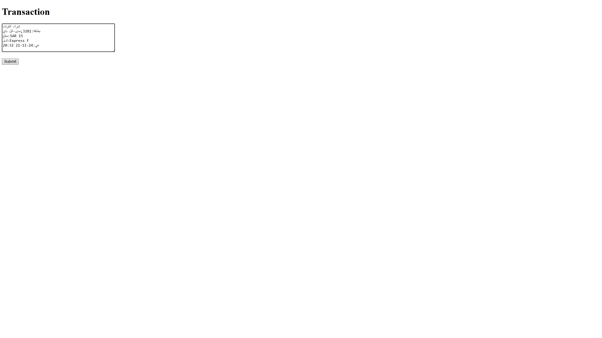

# Bank Transaction Parsing & storage system

this project is a simple system that allows you to input transaction messages via website or you can do it from IOS shortcut app, parse the messages contents, and store the parsed data in a database. It also provides an interface to view and the stored transactions.

# Features im corrently working on
**Multiple User Support:**

allow multiple users to store and manage their transactions.

**Data Analysis and Visualization:**

i want to add a graphical representations and statistical analysis of stored the transaction data.

**Add more formats :**

Improve support for various formats of bank transaction messages.
## Screenshots
Transaction Input Form

Parsed Transaction Details:

Stored Transactions Table:

## Run the project

Clone the project

```bash
  git clone https://github.com/KhaledAlruwita/transaction-parsing-and-storage-system.git
```

install requirments

```bash
  pip install flask pandas requests
```
Run
```bash
  python app.py
```


## 

after running the app.py the web interface will run on http://127.0.0.1:5000 locally

http://127.0.0.1:5000/transactions to see stored transactions.


it will also run on http://[yourpublic ip]:5000
so there might be a security risks ....


## Adding post method on IOS Shortcut app

Create a new Shortcut and Copy this:


## FAQ

#### What MSG format accepted ?

for now only this two are accepted

```
شراء انترنت
بطاقة:3281;مدى-ابل باي
مبلغ:SAR 15 
لدى:Express F
في:24-11-21 20:32
```
```
شراء
بطاقة:3281;مدى-ابل باي
مبلغ:SAR 25
لدى:aisduqa a
في:24-11-9 00:46
```


